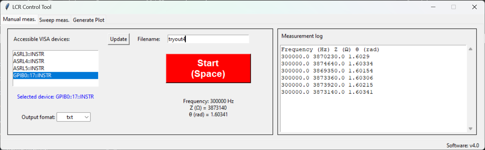
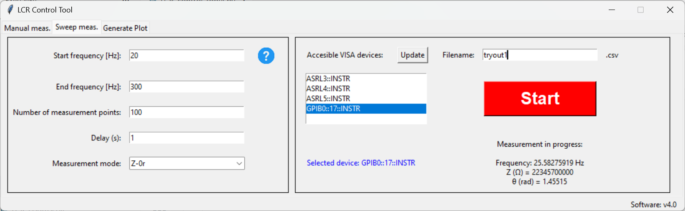
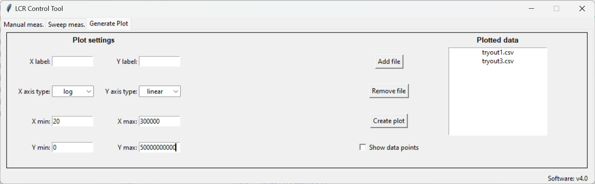
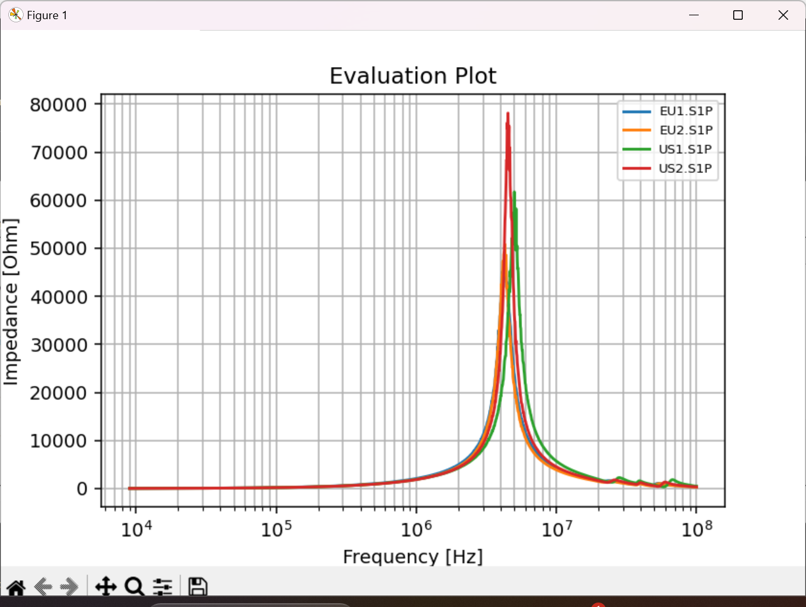

# Precision LCR Meter Automation — LCR Control Tool

> **Python desktop application for automated impedance measurements using a precision LCR meter, featuring a multi-tab GUI, VISA instrument control, frequency sweep automation, real-time pass/fail evaluation, and integrated result plotting.**

---

## Overview

LCR Control Tool is a standalone Windows application built around PyVISA that automates the workflow of precision impedance measurements. It connects to any VISA-compatible LCR meter, controls measurement parameters, logs results in multiple output formats, evaluates measurements against configurable pass/fail limits, and generates publication-ready plots from the collected data — all within a single desktop interface.

The LCR Control tool was compared to the Vector Network Analyzer on the overlapping frequency range in the case of inductor characterization. It has been concluded that on the LCR Meter frequency range, it provides the same or better results as VNA.

The application went through eight development iterations (v1 through v8), with the full version history preserved in the repository.

---

## Key Features

- **VISA instrument communication** — automatic detection of all connected VISA devices, real-time connection status, and configurable timeout handling via PyVISA
- **21 measurement modes** — full coverage of LCR meter impedance parameters: Cp, Cs, Lp, Ls, R, Y, Z, all with secondary parameters (D, Q, G, Rs, Rp, Rdc, θ)
- **Manual measurement mode** — single-trigger measurements via button or keyboard shortcut (Space), with indexed, timestamped logging and live console output
- **Frequency sweep mode** — automated multi-point sweeps across user-defined frequency ranges with configurable step counts and dwell settings
- **Pass/fail limit evaluation** — configurable min/max limits with real-time colour-coded feedback in the console (red highlight + audible alert on out-of-range results)
- **Multi-format data export** — CSV (European locale with `;` delimiter), CSV (English locale with `,` delimiter), and TXT, with automatic file resumption when a named log already exists
- **Integrated plot generator** — post-measurement plot module reads saved CSV/TXT files and renders frequency-domain impedance curves with configurable axis limits
- **Standalone executable** — PyInstaller-packaged `.exe` with no Python installation required on the target machine

---

## Repository Structure

```
Precision_LCR_Meter_Automation/
├── 00_RUN/
│   └── LCR_Control_v8/         # Ready-to-run packaged application (.exe + dependencies)
│
├── 01_Older_versions/           # Full development history: v1 through v7 Python source files
│
├── 02_Pictures/                 # GUI screenshots (21 images) and photos of measured components
│
├── 03_Python/
│   ├── LCR_Control_v8.py        # Main application source (1 400+ lines)
│   ├── icons/                   # Application icons (ok, nok, help, open, LCR logo)
│   ├── build_scripts.txt        # PyInstaller build commands
│   └── dist/                    # PyInstaller output (bundled distribution)
│
└── 04_Documents/
    └── Alternative_measurement_with_Precision_LCR_meter.pdf
```

---

## Application Modules

The GUI is organised as a three-tab `ttk.Notebook`:

### Manual Measurement Tab
Single-point measurements triggered manually. Each trigger queries the instrument for the current frequency and impedance values, appends a new indexed row to the log file, and updates the live console. Supports resuming an existing log file by name — new measurements continue the index sequence without overwriting prior data.



### Sweep Measurement Tab
Fully automated frequency sweep sequences. The module programs the instrument's frequency list, acquires measurements at each point, and writes the complete sweep to the selected output file. Progress is shown in the GUI during acquisition.



### Plot Generation Tab
Standalone plot module that reads previously saved measurement files (any supported format) and renders matplotlib figures. Supports custom axis range overrides and automatic format detection between EN/HU CSV variants.





---

## Measurement Modes Supported

| Category | Modes |
|---|---|
| Capacitance (parallel) | Cp-D, Cp-Q, Cp-G, Cp-Rp |
| Capacitance (series) | Cs-D, Cs-Rs, Cs-Q |
| Inductance (parallel) | Lp-D, Lp-Q, Lp-G, Lp-Rp, Lp-Rdc |
| Inductance (series) | Ls-D, Ls-Q, Ls-Rs, Ls-Rdc |
| Impedance / Admittance | R-X, Y-θ°, Y-θrad, Z-θ°, Z-θrad |

---

## Technology Stack

| Component | Technology |
|---|---|
| Language | Python 3.13 |
| GUI framework | Tkinter / ttk |
| Instrument communication | PyVISA (SCPI over USB/GPIB/LAN) |
| Data handling | Python `csv` module |
| Plotting | Matplotlib |
| Distribution | PyInstaller (standalone `.exe`) |
| Build tooling | Custom batch build script |

---

## Development History

The `01_Older_versions/` folder contains every prior version of the application, from the initial proof-of-concept (`LCR_control.py`) through intermediate tool iterations to the current release. This makes the incremental design decisions — instrument abstraction, GUI restructuring, format handling, limit evaluation — visible across the full development arc.

---

## Author

**Kardos Milan**  
Electrical / Electronics Engineer  
*Specialising in Power Electronics, EMC Validation, Hardware Design, and Embedded Systems*

---

## License

This repository is shared for portfolio and reference purposes. All rights reserved.
